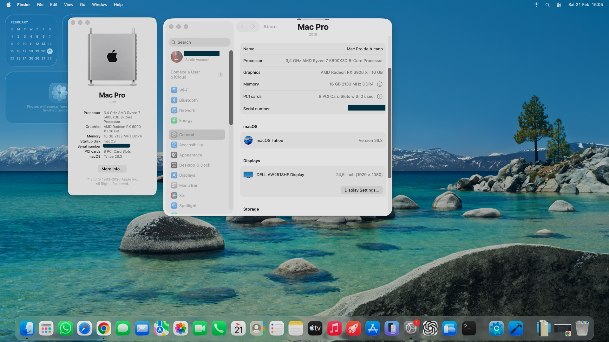

# 🖥️ ASUS TUF GAMING B550M-PLUS - OpenCore EFI

  

  
  
  
  

---

## 📌 About the Project

Fully working EFI for **ASUS TUF GAMING B550M-PLUS** using **OpenCore** on an AMD Ryzen system.

This project focuses on stability, performance, and a clean, well-organized EFI structure.

---

## 🧰 Hardware

| Component | Model |
|------------|--------|
| CPU | Ryzen 5800X3D or AMD 8 cores cpu |
| Motherboard | ASUS TUF GAMING B550M-PLUS |
| GPU | RX 6900 XT |
| Audio | Realtek ALC1200 |
| Ethernet | Realtek 2.5G |
| Storage | NVMe / SATA SSD |

---

## 💻 Tested macOS Versions

| Version | Status |
|----------|--------|
| TAHOE 26.3 | ✅ |
| NONE | ⚠️ Testing |

---

## ⚙️ Working Features

- ✅ UEFI Boot via OpenCore
- ✅ Audio (VoodooHDA / AppleALC not Working)
- ✅ Ethernet
- ✅ Proper USB Mapping
- ✅ NVRAM
- ✅ Apple Store

---

## 🚫 Not Working

- ❌ AirDrop (no compatible Wi-Fi card)
- ❌ Onboard Wi-Fi (not natively supported)

---

## 🧠 AMD Kernel Patch Configuration

This EFI uses AMD Vanilla kernel patches.

⚠️ If you are using a different AMD CPU (different core count), you **must** adjust the core count value inside the AMD patches.

The core count is defined in hexadecimal format within specific `Kernel → Patch` entries inside `config.plist`.

This build is configured for:

> Ryzen 5800X3D  
> 8 cores / 16 threads

If you use a CPU with a different physical core count, locate the patch containing the core value and modify it accordingly.

### Core Count Reference (Hexadecimal)

| Cores | Hex |
|--------|------|
| 4      | 04   |
| 6      | 06   |
| 8      | 08   |
| 12     | 0C   |
| 16     | 10   |

For example:
- 6-core CPU → replace `08` with `06`
- 12-core CPU → replace `08` with `0C`
- 16-core CPU → replace `08` with `10`

Only modify the correct patch entry.  
Do not alter unrelated kernel patches.

---

### Editing Procedure

1. Open `config.plist` using ProperTree
2. Navigate to:
   `Kernel → Patch`
3. Identify the AMD core-related patch
4. Adjust the hexadecimal value in the `Replace` field
5. Save and reboot

For official patch references, consult the [AMD Vanilla repository](https://github.com/AMD-OSX/AMD_Vanilla) and [forum AMD OSX](https://forum.amd-osx.com/).

---

### Recommended Supported AMD GPUs (Native/Near-Native) 

AMD Radeon RX 6000 Series: (e.g., RX 6600, 6800, 6900 XT) – Best performance.

AMD Radeon RX 5000 Series: (e.g., RX 5700 XT) – Good native support.

AMD Radeon Vega Series: (e.g., Vega 56, 64) – Supported.

AMD Radeon RX 500/400 Series: (e.g., RX 580) – Generally supported, though some issues were reported in early beta stages. 

*** ADJUST OPENCORE TO YOUR SUPPORTED VIDEO CARD:
https://www.insanelymac.com/forum

If your computer uses a graphics card other than those natively supported by Tahoe, you should check if there is a patch available:
https://dortania.github.io/OpenCore-Post-Install/gpu-patching/#intel-igpu-patching

After modification, always validate your config and clear NVRAM if required.

### Pos installation:

# 🔈 Audio  

For the audio to work on the motherboard, you need to install the VoodooHDA.pkg file, which is inside the VodooHDA-Installer.zip zip package in this repository. Then restart your macOS.

In System Settings, a new item called VoodooHDA will appear at the very bottom of the list. It is usually already configured correctly. You can select the Sound item from the list and change the audio output.

  Made with ❤️ for the Hackintosh community

